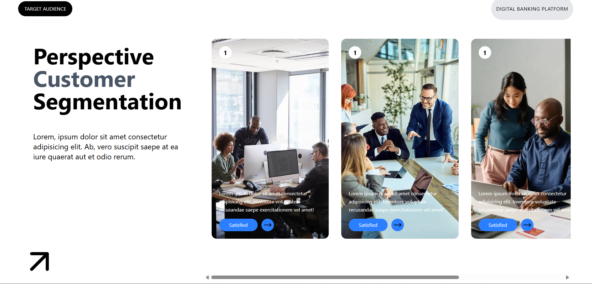

# 🌟 Profile View Webpage

<p align="center">
  
</p>

<h2 align="center">✨ A Modern Profile UI Built With React & Tailwind CSS ✨</h2>

<p align="center">
  A clean, responsive and stylish profile view webpage created using reusable React components and modern Tailwind CSS styling.
</p>

<p align="center">
  🚀 React • 🎨 Tailwind CSS • ⚡ Modern UI
</p>

---

## 📌 About The Project

**Profile View Webpage** is a frontend project designed to showcase a modern user profile interface.

The project focuses on:
- Component-based React architecture
- Responsive layouts
- Clean UI design
- Reusable components
- Modern styling with Tailwind CSS

---

## ✨ Features

🔥 Modern and attractive profile design  
📱 Fully responsive layout  
⚛️ Built with React components  
🎨 Styled using Tailwind CSS  
🖼️ Custom profile image support  
🧩 Organized component structure  
⚡ Fast and lightweight UI  

---

## 🛠️ Tech Stack

| Technology | Usage |
|------------|-------|
| ⚛️ React.js | Building UI components |
| 🎨 Tailwind CSS | Styling & responsiveness |
| 🟨 JavaScript | Functionality |
| 🌐 HTML5 | Structure |
| 📦 npm | Package management |

---

## 📂 Project Structure

```bash
Profile-View/
│
├── public/
│   └── images/
│       └── profile.png
│
├── src/
│   │
│   ├── components/
│   │   ├── Center.jsx
│   │   ├── ImgContainer.jsx
│   │   ├── LeftText.jsx
│   │   ├── Navbar.jsx
│   │   ├── PageContent.jsx
│   │   ├── RightCard.jsx
│   │   └── Section1.jsx
│   │
│   ├── App.jsx
│   └── main.jsx
│
├── package.json
├── tailwind.config.js
└── README.md
```

---

## 🧩 Component Details

| Component | Description |
|-----------|-------------|
| `Navbar.jsx` | Website navigation section |
| `PageContent.jsx` | Main page content wrapper |
| `Section1.jsx` | Main profile section |
| `LeftText.jsx` | Left-side introduction content |
| `Center.jsx` | Central profile content area |
| `ImgContainer.jsx` | Profile image container |
| `RightCard.jsx` | Additional profile information card |
| `App.jsx` | Root application component |

---

## 🚀 Installation & Setup

Clone the repository:

```bash
git clone https://github.com/devankit624/profile-view.git
```

Move into the project folder:

```bash
cd profile-view
```

Install dependencies:

```bash
npm install
```

Start the development server:

```bash
npm run dev
```

Open your browser:

```bash
http://localhost:5173/
```

---

## 🖼️ Preview

<p align="center">
  
</p>

---

## 🎨 Customization

You can easily customize:

- Profile image
- User details
- Colors
- Layout sections
- Cards and content

by editing the React components and Tailwind CSS classes.

---

## 🔮 Future Improvements

- 🌙 Dark mode support
- ✨ Smooth animations
- 🔗 Social media integration
- 📱 More responsive improvements
- 🗄️ Backend profile data integration

---

## 👨‍💻 Developer

### devankit624

GitHub Profile:

:contentReference[oaicite:0]{index=0}

---

<p align="center">
  ⭐ If you like this project, don't forget to give it a star!
</p>